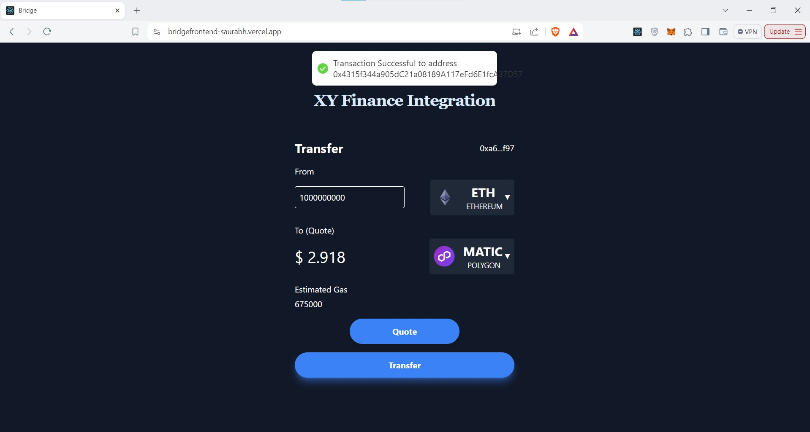

# bridge
## Overview
The Bridge App is a full-stack application built using the MERN (MongoDB, Express.js, React.js, Node.js) stack. This application interacts with the XY Finance API to fetch and display cryptocurrency data, allowing users to bridge tokens across different blockchains. The backend is developed with Node.js and Express, while the frontend is built using React.js.

Postman API Publish Link: https://documenter.getpostman.com/view/23398048/2sA3dyiB2g

Deployed Link: https://bridgefrontend-saurabh.vercel.app/

# API Documentation
### GET GetSupportedTokens
```
https://bridge-fvjj.onrender.com/api/tokens/1
```
```
Example Response

{
  "status": "success",
  "data": {
    "supportedTokens": [
      {
        "address": "0x6985884C4392D348587B19cb9eAAf157F13271cd",
        "symbol": "ZRO",
        "name": "ZRO",
        "chainId": 1,
        "decimals": 18,
        "logoURI": "https://assets.coingecko.com/coins/images/28206/standard/ftxG9_TJ_400x400.jpeg"
      },
      {
        "address": "0xEeeeeEeeeEeEeeEeEeEeeEEEeeeeEeeeeeeeEEeE",
        "symbol": "ETH",
        "name": "ETH",
        "chainId": 1,
        "decimals": 18,
        "logoURI": "https://assets.coingecko.com/coins/images/279/small/ethereum.png?1595348880"
      },
      {
        "address": "0x6B175474E89094C44Da98b954EedeAC495271d0F",
        "symbol": "DAI",
        "name": "DAI",
        "chainId": 1,
        "decimals": 18,
        "logoURI": "https://assets.coingecko.com/coins/images/9956/small/4943.png?1636636734"
      },
      ....
      ....
    ]
  }
}
     
```

### POST Quotes
```
https://bridge-fvjj.onrender.com/api/quotes
```
```
Body raw (json)

{
    "srcChainId":43114,
    "srcQuoteTokenAddress":"0x50b7545627a5162F82A992c33b87aDc75187B218",
    "srcQuoteTokenAmount":1000000,
    "dstChainId":321,
    "dstQuoteTokenAddress":"0x0039f574eE5cC39bdD162E9A88e3EB1f111bAF48"
   
}
```

```
Example Response

{
  "status": "success",
  "data": {
    "dstQuoteTokenUsdValue": "579.72271",
    "estimatedGas": "1050000",
    "bridgeProvider": "yBridge",
    "srcBridgeTokenAddress": "0x9702230A8Ea53601f5cD2dc00fDBc13d4dF4A8c7",
    "dstBridgeTokenAddress": "0x0039f574eE5cC39bdD162E9A88e3EB1f111bAF48",
    "srcSwapProvider": "OKX DEX",
    "dstSwapProvider": "OKX DEX"
  }
}
```

### POST Params
```
https://bridge-fvjj.onrender.com/api/params
```
```
Body raw (json)

{
"srcChainId":10,
"srcQuoteTokenAddress":"0xEeeeeEeeeEeEeeEeEeEeeEEEeeeeEeeeeeeeEEeE",
"srcQuoteTokenAmount":1000000000000000000,
"dstChainId":56,
"dstQuoteTokenAddress":"0xEeeeeEeeeEeEeeEeEeEeeEEEeeeeEeeeeeeeEEeE",
"receiver":"0xb6EFA1C3679f1943f8aC4Fc9463Cc492435c6C92",
"bridgeProvider":"yBridge",
"srcBridgeTokenAddress":"0x94b008aA00579c1307B0EF2c499aD98a8ce58e58",
"dstBridgeTokenAddress":"0x55d398326f99059fF775485246999027B3197955",
"srcSwapProvider":"OKX+DEX",
"dstSwapProvider":"OKX+DEX"
}
```

```
Example Response

{
  "status": "success",
  "data": {
    "to": "0x7a6e01880693093abACcF442fcbED9E0435f1030"
  }
}
```


# Screenshots
- **Bridge App  UI**

  
  

- **Connecting application with metamask**

  
  
  
- **Selecting Supported Token of Specific Chain**

  
  
  
- **Both Source and Destination Token Selected**

  
  

- **Getting Quote Value in USD**

  
   

- ** Swap Transaction Successfull**

  
   
  
  
  
